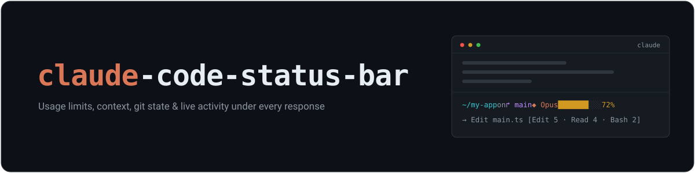
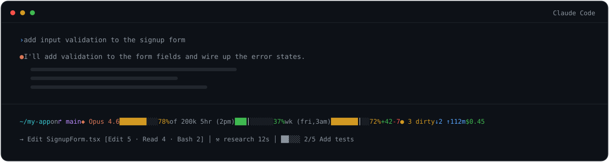
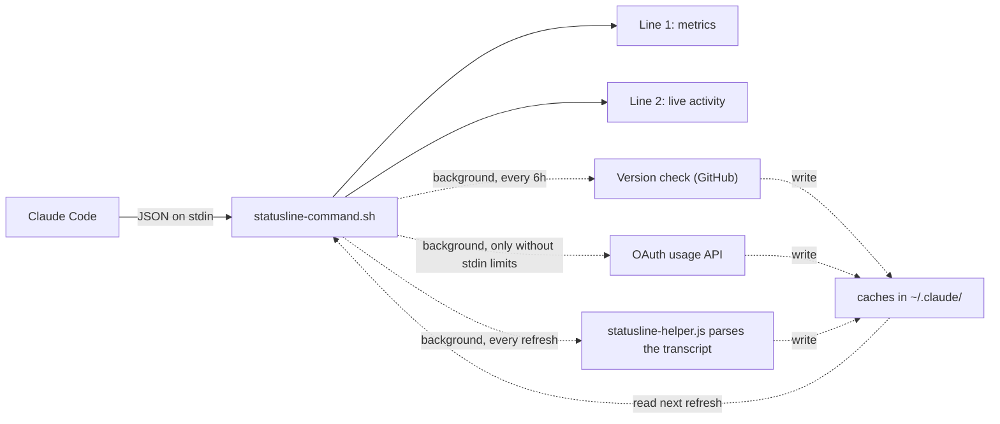

<div align="center">

<picture>
  <source media="(prefers-color-scheme: dark)" srcset="docs/assets/banner-dark.svg">
  <source media="(prefers-color-scheme: light)" srcset="docs/assets/banner-light.svg">
  
</picture>

[](https://github.com/briansmith80/claude-code-status-bar/actions/workflows/shellcheck.yml)
[](https://github.com/briansmith80/claude-code-status-bar/actions/workflows/tests.yml)
[](https://github.com/briansmith80/claude-code-status-bar/releases)
[](LICENSE)

[](https://code.claude.com)

*Your quota burn, context fill, git state, and live activity, visible under every response.*

</div>

---

Claude Code tells you about your rate limit when you hit it, and about your context window when it is nearly full. By then it is usually too late to do anything graceful about either. This status bar puts the numbers you normally discover too late where you can always see them, so you can answer four questions at a glance:

- **Am I burning through my 5-hour or weekly quota too fast?** Usage bars with pacing markers show where you *should* be for even consumption.
- **How full is the context window?** A colour-coded bar warns you before quality degrades.
- **What is Claude actually doing right now?** A live second line shows running tools, subagents, and task progress.
- **What has this session cost?** Session cost and burn rate, colour-coded.

Pure bash core, no jq, no compiled binaries. One-line install. Eight colour themes. Works on macOS, Linux, and Windows (Git Bash / MSYS2). Every network call runs in the background, so the bar itself never blocks.

<div align="center">
  
</div>

```
~/my-app on ↱ main  ◆ Opus 4.6  ███████░│░ 78% of 200k  5hr (2pm) ███│░░░░░░ 37%  wk (fri,3am) ███████│░░ 72%  +42 -7  ● 3 dirty  ↓2 ↑1  12m  $0.45
→ Edit SignupForm.tsx  [Edit 5 · Read 4 · Bash 2]  │  ⚒ research 12s  │  ██░░░ 2/5 Add tests
```

**Contents:** [Highlights](#highlights) · [Requirements](#requirements) · [Install](#install) ·
[The two-line layout](#the-two-line-layout) · [Subagent status line](#subagent-status-line) ·
[Segments](#segments) ·
[Usage limits & pacing](#usage-limits--pacing) · [Configuration](#configuration) ·
[CLI flags](#cli-flags) · [Updating](#updating) · [Uninstall](#uninstall) ·
[How it works](#how-it-works) · [Repository layout](#repository-layout) · [Testing](#testing) ·
[Troubleshooting](#troubleshooting) · [Security](#security) · [Changelog](#changelog) ·
[License](#license)

---

## Highlights

- **21 line-one segments** plus a live activity line, individually toggleable (all except the automatic update notice).
- **Auto-compact awareness**: the context bar carries a `│` marker at the point where Claude Code will auto-compact, and the `▲` warning fires when you are within 20k tokens of it, on any window size. No other status line gets this right.
- **Pacing markers** on the usage bars: a `│` shows where your usage *should* be for even consumption across the window, so "37% used" becomes "37% used and comfortably under pace".
- **Live activity line**: running tools, completed tool counts, subagent status, and todo progress, parsed from Claude Code's transcript by an optional Node.js helper.
- **Subagent panel rows**: while Task-tool subagents run, the agent panel shows status icons, elapsed time, token cost, and a live `tok/s` burn rate per task.
- **Pure bash core** (bash 3.2+, stock macOS works). JSON is parsed with bash regex, so there is no jq dependency to install on Windows.
- **Eight colour themes**: `default`, `nord`, `dracula`, `solarized`, `tokyo-night`, `catppuccin`, `matrix`, `mono`, plus full [`NO_COLOR`](https://no-color.org/) support.
- **Never blocks**: update checks, the usage API fallback, and transcript parsing all run in background subshells. The bar renders from caches.
- **Config survives updates**: your overrides live in `~/.claude/statusline.conf`, which the installer never touches.
- **Security by default**: restrictive file permissions (`umask 077`), OAuth tokens passed to curl via stdin rather than the command line, and ANSI/control-character sanitisation of branch names, paths, and transcript content.
- **Tested**: 69 BATS tests run in CI on Linux, macOS, and Windows (MSYS2), plus ShellCheck and a PowerShell installer check, on every push to main and every pull request.

## Requirements

| Dependency | Needed for | Required? |
|------------|-----------|-----------|
| bash 3.2+ | Everything (stock macOS bash works; Windows gets it from Git for Windows, which Claude Code requires anyway) | Yes |
| curl *or* wget | Install, update check, OAuth usage fallback (`curl.exe` ships with Windows 10+) | Yes |
| git | Branch, dirty count, ahead/behind, and stash segments | Optional |
| Node.js 14+ | Live activity line (line 2) and subagent panel rows | Optional |
| python3 | Pretty-printed `--dump-stdin` output; installer fallback for the `settings.json` merge | Optional |

Claude Code 2.1+ sends usage limits and the transcript path directly to the status bar. On older versions, usage limits fall back to the OAuth API and the activity line is unavailable. Segments whose data Claude Code does not send (vim mode, agent name, token counts) simply stay hidden.

## Install

**macOS / Linux** (or Git Bash on Windows):

```bash
curl -fsSL https://raw.githubusercontent.com/briansmith80/claude-code-status-bar/main/install.sh | bash
```

**Windows (PowerShell):**

```powershell
irm https://raw.githubusercontent.com/briansmith80/claude-code-status-bar/main/install.ps1 | iex
```

The status bar appears after the next Claude Code response. Re-running either installer is always safe, and it is also how you update.

> **Windows notes:** the status bar runs through Git for Windows, which Claude Code on Windows already requires; the PowerShell installer checks for `bash` and tells you what to do if it is missing. Avoid piping `curl.exe` output straight into `bash` from PowerShell: PowerShell 5.1 re-encodes pipeline data between native programs and can corrupt the script. If you prefer the bash installer from PowerShell, run it as one unit instead: `bash -c "curl -fsSL https://raw.githubusercontent.com/briansmith80/claude-code-status-bar/main/install.sh | bash"`

Both installers are non-interactive and transparent about what they do:

1. Download `statusline-command.sh`, the two optional Node.js helpers (`statusline-helper.js` for the activity line, `statusline-subagent.js` for the agent panel rows), and the version file into `~/.claude/`.
2. Create `~/.claude/settings.json` with a `statusLine` entry (plus a `subagentStatusLine` entry when Node.js is available), or merge the missing entries into your existing file **without touching your other settings**. The bash installer merges using node, python3, or python; the PowerShell installer does it natively.
3. Existing `statusLine` and `subagentStatusLine` entries are left untouched, with one exception: commands this installer itself wrote in an older format (MSYS-style `/c/...` or unquoted paths, which fail under some spawn shells on Windows) are upgraded in place on re-run. Migrating from another status line? Remove your old entry first, then re-run the installer.
4. If the bash installer finds no JSON-capable interpreter, it prints the exact snippets to paste into `settings.json` yourself.
5. Clear the update-check cache so the new version is picked up immediately.

### Plugin install

If you prefer the Claude Code plugin system:

```
/plugin marketplace add briansmith80/claude-code-status-bar
/plugin install claude-code-status-bar
/claude-code-status-bar:setup
```

The plugin ships two slash commands:

| Command | What it does |
|---------|--------------|
| `/claude-code-status-bar:setup` | Guided install: copies the files from the plugin cache (no network download), configures `settings.json` (asking before replacing an existing `statusLine` entry), runs a smoke test, and offers to set a theme and toggles. |
| `/claude-code-status-bar:configure` | Interactive editor for `~/.claude/statusline.conf`: themes, segment toggles, display options, and grouping, written as a minimal diff against the defaults. |

### Manual install

1. Download the files to `~/.claude/`:

```bash
curl -fsSL https://raw.githubusercontent.com/briansmith80/claude-code-status-bar/main/statusline-command.sh -o ~/.claude/statusline-command.sh
curl -fsSL https://raw.githubusercontent.com/briansmith80/claude-code-status-bar/main/VERSION -o ~/.claude/.statusline-version
# Optional: live activity line (requires Node.js)
curl -fsSL https://raw.githubusercontent.com/briansmith80/claude-code-status-bar/main/statusline-helper.js -o ~/.claude/statusline-helper.js
```

2. Make it executable: `chmod +x ~/.claude/statusline-command.sh`
3. Add to `~/.claude/settings.json`:

```json
{
  "statusLine": {
    "type": "command",
    "command": "bash ~/.claude/statusline-command.sh"
  }
}
```

## The two-line layout

**Line 1** is the metrics bar: directory, branch, model, context, usage limits, git state, duration, cost.

**Line 2** is the live activity line. Active work pops in theme colours while history recedes into dim text:

```
⠙ Bash npm test 1m24s  │  → Edit SignupForm.tsx  [Edit 5 · Read 4 · Bash 2]  │  ⚒ research 12s  │  ██░░░ 2/5 Add tests
```

| You see | It means |
|---------|----------|
| `⠙ Edit main.ts...` | Tools running right now (up to the last two), in the theme's warning colour behind a spinner; elapsed time appears once a tool runs over 5 seconds and is heat-coloured (green under 30s, yellow under 2m, red beyond, so "stuck" is visible at a glance) |
| `→ Edit main.ts` | The last completed tool, shown when nothing is running; flashes bright green with a `✓` for its first ~5 seconds |
| `✗ Bash npm test` | The most recent tool failure, in red, shown for five minutes |
| `[Edit 5 · Read 4 · Bash 2]` | The top three tool counts for the session |
| `⚒ research 12s` | A running subagent (warning colour) with its heat-coloured elapsed time |
| `⚒ research ✓ (2)` | Finished subagents (and how many) |
| `██░░░ 2/5 Add tests` | Todo progress; filled cells shade through a per-theme gradient |

The spinner picks its frame from the clock, so it advances at whatever rate Claude Code re-runs the script: each event-driven re-render, plus the `refreshInterval` statusLine setting if you set one. **Pick a `refreshInterval` comfortably above the script's runtime on your machine** (`bash ~/.claude/statusline-command.sh --benchmark` measures it). Claude Code aborts an in-flight run when the next one starts, and an aborted run blanks the whole bar, so an interval that's too low erases the status line entirely. On macOS/Linux the script runs in well under 100ms and `1` is fine; on Windows (MSYS bash) a run takes ~300ms since v2.8.0, so `2` is comfortable there. When the cached activity ages past `activity_fresh_seconds` (default 45) the colours drop back to all-dim, so stale data reads as stale, powerlevel10k style. Set `activity_colour=false` to keep the classic all-dim line permanently; `NO_COLOR` and the mono theme degrade to plain text automatically.

Good to know:

- The line appears only when there is activity to show. It hides when the cached activity is older than `activity_ttl_seconds` (default 120, chosen to stay above typical `refreshInterval` values) and reappears once the helper has re-parsed the transcript.
- Completed tools, failures, and finished subagents stop being displayed five minutes after they finish; the tool counts cover the whole session.
- Transcript parsing is incremental: each run parses only the lines appended since the last one, so even very long sessions stay cheap. The line is also trimmed to your terminal width (via `$COLUMNS`) so it never wraps.
- Parsing happens in a background process, so the line runs one status bar refresh behind the transcript. That keeps the bar itself instant.
- It requires Node.js on your `PATH`, the `statusline-helper.js` file (installed by default), and a Claude Code version that sends `transcript_path` (2.1+). If any of those are missing, line 2 silently stays off and everything else works.
- Each session gets its own activity cache (keyed by Claude Code's session ID), so parallel Claude Code windows never show each other's activity. Stale per-session caches are swept automatically after a day.
- Disable it entirely with `show_activity=false` in your config.

## Subagent status line

While agents, workflows, or background tasks run, Claude Code shows an agent panel below the prompt. The optional `statusline-subagent.js` renderer (installed and wired automatically when Node.js is available) restyles the subagent rows in that panel, the ones spawned through the Task tool, to match the status bar and adds live numbers:

```
⚒ Audit the usage parsing code  1m24s · 12.4k tok · 354 tok/s ▄▅▆▇▇▆█
✓ Verify the rate-limit fix     3m2s · 48.1k tok
✗ security review               41s · 2k tok
```

- **Status at a glance**: `⚒` running (yellow), `✓` done (green), `✗` failed (red), `◌` queued (dim), using your `colour_theme` and honouring `NO_COLOR`.
- **Elapsed time** per task, ticking with each panel refresh (roughly every 5 seconds).
- **Token cost and burn rate**: Claude Code samples each task's token count on every refresh; the renderer turns those samples into a `tok/s` rate plus a small sparkline, so a runaway agent is visible before it finishes.
- **Aligned and width-aware**: descriptions are padded into a column across rows, and each row is trimmed to the panel width (the sparkline is dropped first, then the rate).
- **Fail-safe**: on any error or unexpected input the script prints nothing and Claude Code falls back to its default rows. Set `subagent_rows=false` in `statusline.conf` to keep the defaults permanently.
- **Scope**: Claude Code only delegates Task-tool subagent rows to custom renderers (verified against CC 2.1.170). Workflow and background-task rows are drawn by a separate panel path and keep Claude Code's built-in style. The renderer already handles those task shapes, so they will light up if a later Claude Code starts sending them.

The installer wires this into `settings.json` when Node.js is present, leaving any existing entry untouched:

```json
{
  "subagentStatusLine": {
    "type": "command",
    "command": "node ~/.claude/statusline-subagent.js"
  }
}
```

On Windows, use a quoted Windows-native path instead of `~` (for example `node \"C:/Users/name/.claude/statusline-subagent.js\"`). Claude Code may spawn this command via PowerShell or cmd, which neither expand `~` nor resolve MSYS-style `/c/...` paths for node, so those forms fail silently and the panel keeps its default rows. The installers write the native form for you.

## Segments

All segments are on by default except token counts and cost rate. Zero-valued segments auto-hide (configurable via `auto_hide`), and segments whose data is missing are simply omitted, so your actual bar is usually shorter than this table.

| Segment | Looks like | Toggle | Notes |
|---------|-----------|--------|-------|
| Directory | `~/my-app` | `show_directory` | Prefers `workspace.current_dir`, falls back to `cwd`; home shown as `~` |
| Branch | `on ↱ main` | `show_branch` | Short commit hash when detached; truncate long names with `branch_max_length` |
| Vim mode | `NORMAL` | `show_vim_mode` | Only when Claude Code sends `vim.mode` |
| Model | `◆ Opus 4.6` | `show_model` | Tier colours: Haiku green, Sonnet yellow, Opus orange, Fable purple (theme-aware) |
| Agent name | `▸ my-agent` | `show_agent` | Only when running with an agent |
| Effort level | `eff:xhigh` | `show_effort` | Reasoning effort, when Claude Code sends `effort.level` (CC 2.1.133+) |
| Fast mode | `⚡ fast` | `show_fast_mode` | Only when fast mode is on; yellow because it bills at a higher rate |
| Context bar | `███████░│░ 78% of 200k` | `show_context_bar` | Green under 50%, yellow 50-79%, red 80%+. The `│` marker sits at the auto-compact point; `▲` appears within 20k tokens of it (see below) |
| Token counts | `45k in 12k out` | `show_tokens` *(off)* | Tokens in the current context (cumulative session totals before CC 2.1.132) |
| 5-hour usage | `5hr (2pm) ███│░░░░░░ 37%` | `show_usage_5h` | Rolling 5-hour window with reset time and pacing marker |
| Weekly usage | `wk (fri,3am) ███████│░░ 72%` | `show_usage_7d` | Rolling 7-day window with reset day/time and pacing marker |
| Lines changed | `+42 -7` | `show_lines_changed` | Session lines added (green) and removed (red) |
| Dirty count | `● 3 dirty` | `show_dirty_count` | Staged + unstaged + untracked files |
| Ahead/behind | `↓2 ↑1` | `show_ahead_behind` | Commits behind/ahead of upstream; hidden when there is no upstream |
| Stash count | `≡ stash:2` | `show_stash` | Git stash entries |
| Pull request | `PR #1234` | `show_pr` | Open PR for the branch (CC 2.1.145+); colour = review state: green approved, yellow pending, red changes requested, dim draft. Clickable (links to the PR) in terminals with OSC 8 support; `pr_link=false` disables |
| Duration | `12m` / `1h23m` | `show_duration` | Session duration |
| Worktree | `⊞ hotfix` | `show_worktree` | Worktree name; covers `--worktree` sessions and any linked git worktree (CC 2.1.145+) |
| Cost | `$0.45` | `show_cost` | Green under $1, yellow $1-5, red $5+ |
| Cost rate | `$2.10/hr` | `show_cost_rate` *(off)* | Burn rate; appears once the session is over a minute old |
| Update notice | `↑ 2.11.0` | *(automatic)* | Background version check against GitHub every 6 hours; shows the new version, links to its release notes, and `--update` installs it |
| Live activity | *(line 2, see above)* | `show_activity` | Running tools, tool counts, subagents, todo progress; `activity_colour=false` for the classic all-dim look |

Before the first API response of a session, the bar shows a dim `Starting...` placeholder. That is normal; the real segments appear as soon as Claude Code sends model and context data.

## Usage limits & pacing

The bar shows your Anthropic usage limits as colour-coded progress bars with reset labels:

```
5hr (2pm) ███│░░░░░░ 37%  wk (fri,3am) ███████│░░ 72%
```

- **5hr**: the rolling 5-hour window, with its reset time (`2pm`).
- **wk**: the rolling 7-day window, with its reset day and time (`fri,3am`).
- **`│` pacing marker**: where your usage *should* be for even consumption across the window. Bar past the marker means you are ahead of pace and may hit the limit early; behind it means you have headroom.
- **`~` suffix** (e.g. `37%~`): the data came from the OAuth fallback and is stale (more than two refresh intervals old).

### Label style: reset time or countdown

By default the label shows the time remaining until reset: `5hr (2h20m)`, `wk (3d4h)`. Set `usage_label=clock` in your config to show the reset moment instead: `5hr (2pm)`, `wk (fri,3am)`.

The status bar re-renders when Claude Code triggers it (after responses and state changes), so a countdown can sit stale while you are away. Claude Code can also re-run the status bar on a timer via `refreshInterval` (seconds) on the `statusLine` block. **Fresh installs set `refreshInterval: 60` automatically** (so the default countdown stays current and the activity line's elapsed times keep moving). The installer only sets it when it first writes the `statusLine` block, so an existing `refreshInterval` is never overwritten. Tune or remove it in `~/.claude/settings.json`:

```json
{
  "statusLine": {
    "type": "command",
    "command": "bash ~/.claude/statusline-command.sh",
    "refreshInterval": 60
  }
}
```

On Windows the script takes longer to run (~285ms), so keep `refreshInterval` at `2` or higher there; a value below the script's own runtime can blank the bar.

### Where the data comes from

1. **Stdin (preferred)**: Claude Code 2.1+ sends `rate_limits` directly in the JSON it pipes to the status bar. Real-time, zero network requests, no configuration.
2. **OAuth API (fallback)**: on older Claude Code versions, the script fetches `api.anthropic.com/api/oauth/usage` in a background subshell, cached for 10 minutes (`usage_cache_seconds`). On repeated failures it backs off exponentially, up to 30 minutes, tracked in `~/.claude/.statusline-usage-backoff`.

If neither source has data, the usage segments are hidden. Run `--dump-stdin` (see [CLI flags](#cli-flags)) to check which fields your Claude Code version sends.

### Credentials (OAuth fallback only)

The fallback reads your existing Claude Code token; nothing extra to configure:

| Platform | Credential source |
|----------|------------------|
| macOS | Keychain (`Claude Code-credentials`), falling back to `~/.claude/.credentials.json` |
| Linux | `~/.claude/.credentials.json` |
| Windows / MSYS2 | `~/.claude/.credentials.json` |

The token must have the `user:profile` scope, which browser sign-in grants automatically. Tokens created with `claude setup-token` only have `user:inference` and will not work; quit all Claude Code instances and restart to trigger a fresh browser OAuth login.

## Configuration

Create `~/.claude/statusline.conf` with only the lines you want to change. The file is never overwritten by updates. Every key is shown below with its default:

```bash
# ~/.claude/statusline.conf

# ── Theme ────────────────────────────────────────────────
colour_theme=default        # default | nord | dracula | solarized | tokyo-night | catppuccin | matrix | mono

# ── Segment toggles ──────────────────────────────────────
show_directory=true
show_branch=true
show_vim_mode=true
show_model=true
show_agent=true
show_context_bar=true
show_tokens=false           # opt-in
show_effort=true            # reasoning effort, e.g. eff:xhigh (needs CC 2.1.133+)
show_fast_mode=true         # ⚡ fast indicator while fast mode is on
show_usage_5h=true
show_usage_7d=true
show_lines_changed=true
show_dirty_count=true
show_ahead_behind=true
show_stash=true
show_pr=true
show_duration=true
show_worktree=true
show_cost=true
show_cost_rate=false        # opt-in; shows after the session is a minute old
show_activity=true          # the live line 2 (requires Node.js)
activity_colour=true        # per-segment colours, spinner, flash, heat, gradient
activity_fresh_seconds=45   # drop line 2 back to all-dim when data is older than this
activity_ttl_seconds=120    # hide line 2 when its cache is older than this
activity_pulse=false        # opt-in: the running label breathes (bold/faint alternation); see note below on refreshInterval
activity_scanner=false      # opt-in: KITT-style tracker while something runs >30s; see note below on refreshInterval
pr_link=true                # PR segment links to the pull request (OSC 8 hyperlink)
subagent_rows=true          # styled subagent panel rows (requires Node.js)

# ── Display ──────────────────────────────────────────────
use_icons=true              # ↱ ◆ ▸ ● ≡ ⊞ ↑ prefixes and the ▲ context warning
auto_hide=true              # hide zero-valued segments
bar_width=10                # progress bar width in characters
branch_max_length=          # truncate long branch names with … (empty = no limit)
context_warn_threshold=auto # auto = ▲ within 20k tokens of auto-compact; or a raw % like 80

# ── Truncation for narrow terminals ──────────────────────
enable_truncation=false     # drop low-priority segments when line 1 is too wide
max_width=                  # width budget (empty = auto: tput cols, then $COLUMNS, then 120)

# ── Grouping ─────────────────────────────────────────────
use_groups=false            # bracket related segments together
group_open="["
group_close="]"

# ── Usage limits ─────────────────────────────────────────
usage_label=countdown       # countdown = time remaining (2h20m, default); clock = reset moment (2pm)
usage_cache_seconds=600     # OAuth fallback refresh interval (ignored when stdin provides limits)

# ── Updates ──────────────────────────────────────────────
auto_update=false           # opt-in: install new versions automatically in the background
```

A few details worth knowing:

- **Context warnings are compaction-aware**: Claude Code auto-compacts at a fixed reserve below the window (not at a percentage), which lands at roughly 83% of a 200k window but almost 97% of a 1M window. With `context_warn_threshold=auto` (the default), the `│` marker on the context bar shows that point and `▲` appears within 20k tokens of it, matching Claude Code's own context-low timing. The maths honours `CLAUDE_CODE_AUTO_COMPACT_WINDOW`, the `autoCompactWindow` setting from `/autocompact`, and `DISABLE_AUTO_COMPACT` (which removes the marker and falls back to a raw 80% rule). Set a number instead of `auto` to keep the old fixed-percentage behaviour. When `▲` appears, a `/compact` at your next natural stopping point beats letting auto-compact summarize mid-task.
- **Animated effects need a low `refreshInterval`**: the spinner, the `activity_scanner` sweep, and the `activity_pulse` breath are all driven by the wall clock, so they only visibly move when the bar re-renders often. If you enable `activity_pulse` or `activity_scanner`, set a low **odd** `refreshInterval` such as `3` on the `statusLine` block (see the [usage-label section](#label-style-reset-time-or-countdown)). Odd matters for the pulse: its breath toggles on each whole second, so an even interval like `2` can keep sampling the same beat and leave it stuck bold or faint. On the default `refreshInterval: 60` these effects sit still, which is why both ship off by default.
- **`NO_COLOR`**: when the [`NO_COLOR`](https://no-color.org/) environment variable is set, all colours are disabled regardless of theme.
- **Truncation order**: with `enable_truncation=true`, segments are dropped tier by tier, least important first: the update notice, then worktree, then duration, then ahead/behind, stash and the PR number, then effort, tokens, lines changed and dirty count, then fast mode, cost and cost rate, then vim mode, model, agent and the usage bars, then the context bar, and last of all directory and branch.
- **Groups**: with `use_groups=true`, related segments are bracketed: `[model + context]` `[usage bars]` `[git stats]` `[duration + cost]`. Directory/branch, vim, agent, effort, fast mode, tokens, worktree, and the update notice stay outside groups. Brackets wrap contiguous runs, so an ungrouped segment sitting between group members (an agent name or a worktree) splits the bracket around itself.
- **Legacy alias**: `show_usage_weekly` from older configs still works as an alias for `show_usage_7d`.
- **Trust level**: the config is sourced as bash, so treat it like your `.bashrc`: only put your own settings in it.

## Colour themes

Eight built-in themes, spread across a saturation/temperature ladder so no two read alike. Each strip shows the theme's palette in the order the colours land on the bar: **directory · branch · model · Opus accent · additions · warnings/cost · removals · pacing marker**.

| Theme | Vibe | Palette |
|-------|------|---------|
| `default` | bold, bright primary |  |
| `dracula` | neon, electric |  |
| `tokyo-night` | deep midnight blue + neon |  |
| `catppuccin` | soft warm pastel |  |
| `solarized` | earthy, vintage |  |
| `nord` | muted, cool steel |  |
| `matrix` | monochrome phosphor green |  |
| `mono` | greyscale, no colour |  |

The named themes render in **24-bit truecolour** when your terminal supports it (detected via `$COLORTERM`; force with `STATUSLINE_TRUECOLOR=1`/`0`), and fall back to the nearest **256-colour** otherwise, so Terminal.app and older terminals still get sensible, distinct colours. `default` is special: it uses your terminal's own ANSI palette (the swatch shows a representative set), so it tracks whatever scheme your terminal uses. `matrix` is a *Matrix* digital-rain tribute, monochrome phosphor green separated by brightness rather than hue (removals are a dim green, not red). `mono` emits no colour at all, and **any** theme degrades to plain text under [`NO_COLOR`](https://no-color.org/). (Swatches are generated by `docs/assets/themes/generate-swatches.js` from the palettes in `apply_theme()`.)

### Changing the theme

Add or edit the `colour_theme` line in `~/.claude/statusline.conf` (the file is created on first install; make it if it isn't there):

```bash
colour_theme=tokyo-night    # default | nord | dracula | solarized | tokyo-night | catppuccin | matrix | mono
```

Or run the `/claude-code-status-bar:configure` slash command and pick a theme interactively. Either way it takes effect on the next status-bar render (after Claude Code's next response), no restart needed. Confirm it applied with:

```bash
bash ~/.claude/statusline-command.sh --dump-config | grep colour_theme
```

## CLI flags

The script normally runs with no arguments, fed JSON on stdin by Claude Code. The flags exist for setup, diagnostics, and removal:

| Flag | Description |
|------|-------------|
| `--help`, `-h` | Show usage info and exit. |
| `--version`, `-v` | Print the installed version and exit. |
| `--check-update` | Clear the update cache and synchronously check GitHub for a newer version. Prints current and latest, plus the `--update` command if an update exists. |
| `--update` | Download and install the latest version in place: overwrites `statusline-command.sh` and the two Node helpers, bumps `.statusline-version`, and clears the update cache. Each file is staged and only swapped in once every download succeeds, so a failed fetch changes nothing. Never touches `statusline.conf` or `settings.json`. |
| `--dump-config` | Print the resolved configuration (defaults merged with your `statusline.conf`) as sorted `key=value` lines. The fastest answer to "why isn't my override taking effect?" |
| `--dump-stdin` | Echo the JSON Claude Code sends (pretty-printed when a working python3 is on PATH) plus a YES/NO report of detected fields: `rate_limits`, `transcript_path`, nested `model`, nested `context_window`. Pipe JSON in: `echo '<json>' \| bash ~/.claude/statusline-command.sh --dump-stdin` |
| `--benchmark [N]` | Time N end-to-end runs (default 5) against a realistic canned payload and report min/avg/max, for picking a safe `refreshInterval`. Needs GNU date `%N` (Linux/MSYS2). Add `STATUSLINE_PROFILE=1` to any run for a per-phase breakdown on stderr. |
| `--uninstall` | Interactively remove all installed files. See [Uninstall](#uninstall). |

## Updating

When a new version is available you'll see `↑ <version>` in the bar (e.g. `↑ 2.11.0`), clickable through to that release's notes. The check runs in the background every 6 hours and never slows anything down. The simplest way to update is the built-in self-update (works in bash and PowerShell alike, as do all the [CLI flags](#cli-flags)):

```bash
bash ~/.claude/statusline-command.sh --update
```

It downloads the latest script and helpers, swaps them in only once every file has downloaded, bumps the version, and leaves `statusline.conf` and your `settings.json` entries alone. Run `--check-update` first if you just want to see what's current versus latest.

### Automatic updates (opt-in)

Set `auto_update=true` in `statusline.conf` and the bar installs new versions for you: once the background check flags a newer release, it runs the same self-update in a detached background process (it never blocks rendering), serialised with a lock so parallel sessions don't all download at once. A failed or interrupted download changes nothing, and `statusline.conf`/`settings.json` are never touched. It stays off by default so the tool never replaces its own executable without you asking; leave it off if you prefer to review releases before updating.

Re-running the installer also updates in place and is the way to go if your install is too old to have `--update`:

```bash
curl -fsSL https://raw.githubusercontent.com/briansmith80/claude-code-status-bar/main/install.sh | bash
```

```powershell
irm https://raw.githubusercontent.com/briansmith80/claude-code-status-bar/main/install.ps1 | iex
```

> Right after a release, GitHub's raw CDN can serve the previous version for a few minutes. If `--update` or `--check-update` reports an older version than expected, wait five minutes and try again.

## Uninstall

```bash
bash ~/.claude/statusline-command.sh --uninstall
```

It lists what will be deleted and asks for confirmation, prompts **separately** before removing `statusline.conf` (so you can keep your config for a reinstall), and reminds you to remove the `statusLine` block from `~/.claude/settings.json` yourself.

<details>
<summary>Manual removal, if you prefer</summary>

```bash
rm -f ~/.claude/statusline-command.sh
rm -f ~/.claude/statusline-helper.js
rm -f ~/.claude/statusline-subagent.js
rm -f ~/.claude/.statusline-version
rm -f ~/.claude/.statusline-update-cache
rm -f ~/.claude/.statusline-usage-cache
rm -f ~/.claude/.statusline-usage-backoff
rm -f ~/.claude/.statusline-activity-cache
rm -f ~/.claude/.statusline-activity-cache.*
rm -rf ~/.claude/.statusline-transcript-cache
rm -f ~/.claude/statusline.conf   # your config; skip this line to keep it
```

Then remove the `"statusLine"` block from `~/.claude/settings.json`.

</details>

## How it works

Claude Code pipes a JSON payload to the script on every refresh. The script parses it with bash regex (no jq), builds the segments, and prints one or two lines. Everything slow happens in background subshells that write caches; the bar only ever reads caches, so it never waits on the network or on transcript parsing.



Files at `~/.claude/` after install:

| File | Purpose | Overwritten on update? |
|------|---------|----------------------|
| `statusline-command.sh` | The script Claude Code runs | Yes |
| `statusline-helper.js` | Node.js transcript parser (optional) | Yes |
| `statusline-subagent.js` | Node.js subagent panel renderer (optional) | Yes |
| `.statusline-version` | Installed version | Yes |
| `statusline.conf` | Your config overrides | **Never** |
| `.statusline-update-cache` | Update check cache | Cleared on update |
| `.statusline-usage-cache` | OAuth usage cache | Auto-refreshes |
| `.statusline-usage-backoff` | OAuth failure backoff state | Auto-expires |
| `.statusline-activity-cache.<id>` | Live activity cache (one per session) | Auto-refreshes, swept after a day |
| `.statusline-transcript-cache/` | Parsed transcript cache | Auto-invalidates |

All caches are created with `umask 077`, so they are readable only by you.

## Repository layout

```
claude-code-status-bar/
├── README.md
├── CHANGELOG.md                  # release history
├── LICENSE                       # MIT
├── VERSION                       # single source of truth for the version
├── install.sh                    # one-line installer / updater (macOS, Linux, Git Bash)
├── install.ps1                   # one-line installer / updater (Windows PowerShell)
├── statusline-command.sh         # the status bar (pure bash, installed to ~/.claude/)
├── statusline-helper.js          # optional Node.js transcript parser (live activity line)
├── statusline-subagent.js        # optional Node.js renderer for the subagent panel rows
├── docs/
│   └── assets/                   # README images (banner, terminal demo)
├── commands/
│   ├── setup.md                  # /claude-code-status-bar:setup
│   └── configure.md              # /claude-code-status-bar:configure
├── .claude-plugin/
│   ├── plugin.json               # plugin manifest
│   └── marketplace.json          # marketplace catalog for /plugin marketplace add
├── .github/workflows/
│   ├── shellcheck.yml            # lint (pushes to main, PRs)
│   └── tests.yml                 # BATS suite on Linux, macOS, Windows (MSYS2)
├── tests/                        # 69 BATS tests across 9 files
├── ROADMAP.md                    # feature roadmap & competitive landscape
├── SPRINTS.md                    # sprint plan
└── CLAUDE.md                     # project guide for working on this repo with Claude Code
```

## Testing

A BATS suite under [`tests/`](tests/) covers schema parsing (old flat, new nested, and the CC 2.1.x shapes), segments, all seven themes, `NO_COLOR`, config overrides, context window formatting and compaction awareness, the live activity helper, the colourful activity line (token mapping, stale fade, injection safety, width trim), the git segments (branch, dirty, ahead/behind, stash, detached HEAD), and the subagent panel renderer. Each test runs in a sandboxed `HOME`, so your real config and credentials are never touched. CI runs the suite on Linux, macOS, and Windows (MSYS2), plus ShellCheck.

To run locally, install [bats-core](https://github.com/bats-core/bats-core):

```bash
brew install bats-core            # macOS
sudo apt-get install -y bats      # Debian / Ubuntu
# Windows (Git Bash / MSYS2): no pacman package; run bats-core from a clone
git clone --depth 1 https://github.com/bats-core/bats-core.git ~/bats-core
```

Then from the repo root:

```bash
bats tests/                       # macOS / Linux
~/bats-core/bin/bats tests/       # Windows
```

See [`tests/README.md`](tests/README.md) for layout details.

## Troubleshooting

- **The bar doesn't appear at all.** Check that `~/.claude/settings.json` has the `statusLine` entry (the installer skips this step if any `statusLine` entry already exists, including one from a different status line). Then wait for the next Claude Code response; the bar renders after responses, not on launch.
- **The bar disappeared after setting a low `refreshInterval`.** Claude Code aborts an in-flight statusLine run when the next one starts, and an aborted run blanks the bar. If the interval is below the script's runtime, every run is aborted and nothing ever renders. Measure with `--benchmark` (since v2.8.0: ~300ms on Windows under MSYS bash, well under 100ms on macOS/Linux), then pick an interval comfortably above it: `2`+ on Windows, `1` elsewhere.
- **The bar just says `Starting...`** Normal. It means Claude Code hasn't sent model or context data yet, which happens at the start of every session.
- **A segment I enabled isn't showing.** Most segments auto-hide when their value is zero or their data is missing. Run `bash ~/.claude/statusline-command.sh --dump-config` to confirm your override took effect, and `--dump-stdin` to see which fields your Claude Code version actually sends.
- **Usage segments are missing.** On Claude Code 2.1+ they should appear automatically from stdin. For the OAuth fallback: check credentials exist (see [Credentials](#credentials-oauth-fallback-only)), then clear the caches and let them refresh: `rm -f ~/.claude/.statusline-usage-cache ~/.claude/.statusline-usage-backoff`. The backoff file matters: after repeated failures the script waits up to 30 minutes before retrying.
- **Usage shows `~` after the percentage.** The OAuth data is stale. Usually transient; if it persists, clear the two cache files above.
- **The activity line never appears.** It needs Node.js on `PATH`, `~/.claude/statusline-helper.js`, and a Claude Code version that sends `transcript_path` (`--dump-stdin` reports this as YES/NO). Also note it lags one refresh behind and hides when its cache is older than `activity_ttl_seconds` (default 120).
- **`--check-update` shows an old version right after a release.** GitHub's raw CDN caches for a few minutes. Try again shortly.

## Security

Points that matter for a tool that runs on every response and can read your OAuth token:

- All cache and temp files are created with `umask 077` (owner-readable only).
- The OAuth token is passed to curl via `--config -` on stdin, so it never appears in the process list. The wget fallback cannot do this and passes the header as a command-line argument, so curl is strongly preferred; wget also runs with `--max-redirect=0` to prevent token leakage on redirects.
- Branch names, paths, worktree names, and all transcript-derived text are stripped of ANSI escapes and control characters before being printed to your terminal.
- `~/.claude/statusline.conf` is sourced as bash. It has the same trust level as your `.bashrc`.
- The helper and its caches store activity summaries, not transcript content: tool names, file basenames, short command and pattern snippets (30 characters at most), and todo or agent description snippets (50 characters at most).

## Changelog

Release history lives in [CHANGELOG.md](CHANGELOG.md). Recent highlights:

- **2.9.0**: Clickable PR segment (OSC 8 hyperlink to the pull request, `pr_link`), opt-in `activity_pulse` and `activity_scanner` effects for line 2, and tag-driven release automation.
- **2.8.0**: 4.5x faster on Windows (~285ms per run, was ~1286ms): internal helpers return via globals instead of forked command substitutions, git work consolidated to two calls via porcelain v2, pure-bash sanitize and width maths, and fork-free countdown labels. New `--benchmark` flag and `STATUSLINE_PROFILE=1` per-phase profiling; first direct git-segment test coverage.
- **2.7.0**: Colourful activity line: per-segment theme colours, a clock-driven spinner on running tools, heat-coloured elapsed times, completion flash, gradient todo bar, and stale-fade, with `activity_colour=false` restoring the classic all-dim look. Plus ANSI-aware width trimming and four long-standing fixes (quote truncation, `NO_COLOR` leak, BSD sed, non-UTF-8 locales).
- **2.6.1**: Windows install hardening: settings.json gets quoted Windows-native paths (the MSYS `/c/...` form broke the subagent renderer under PowerShell/cmd spawns), both installers migrate their own older commands on re-run, and docs now state the renderer's real scope (Task-tool subagent rows only).
- **2.6.0**: Compaction-aware context warnings (a `│` marker at the auto-compact point, `▲` timed to Claude Code's own warning), the `▲ 200k+` segment retired, and a native Windows PowerShell installer.
- **2.5.0**: Subagent panel renderer: status icons, elapsed time, token cost, and live `tok/s` burn rate for every running Task-tool subagent.
- **2.4.0**: Live activity overhaul: incremental transcript parsing, age-out of finished items, a `✗` failed-tool indicator, elapsed time on running tools, the `activity_ttl_seconds` config, and terminal-width trimming.
- **2.3.0**: Countdown labels for usage bars (`usage_label=countdown`), a PR segment, worktree detection for any linked worktree, and per-session activity caches.
- **2.2.0**: Claude Code 2.1.170 audit. Fable/Mythos models get a theme-aware purple tier colour, new effort level and fast mode segments, rate-limit parsing scoped to the `rate_limits` block, and ISO timestamp tolerance.
- **2.1.1**: README overhaul with verified examples, a fix for doubled progress bars under `NO_COLOR`/mono, and the marketplace manifest for `/plugin marketplace add`.
- **2.1.0**: BATS test suite, three-platform CI, and four new CLI flags (`--help`, `--version`, `--dump-config`, `--uninstall`).
- **2.0.x**: theme-aware Opus colouring, `of 1M` formatting for million-token context windows, nested-JSON parsing fixes.
- **2.0.0**: stdin-native rate limits, the live activity line, and plugin marketplace support.

## License

MIT, see [LICENSE](LICENSE).
