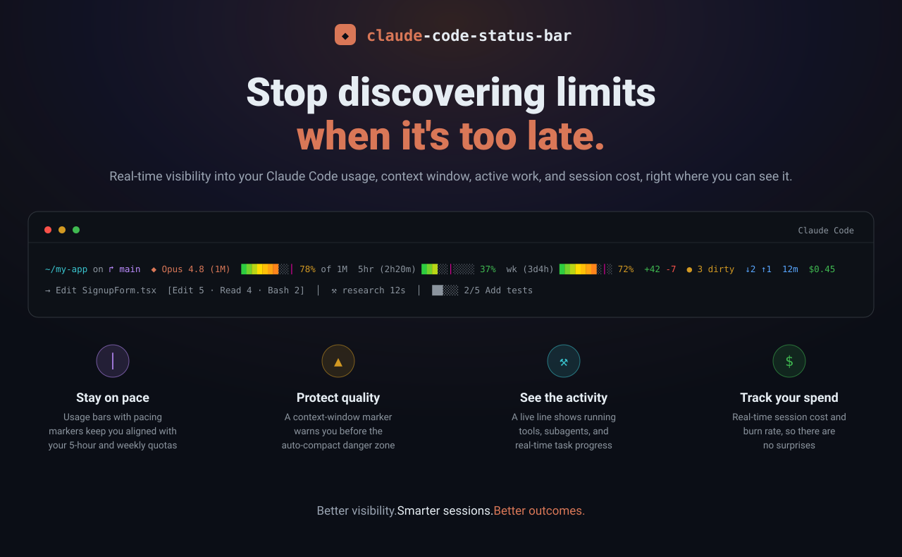
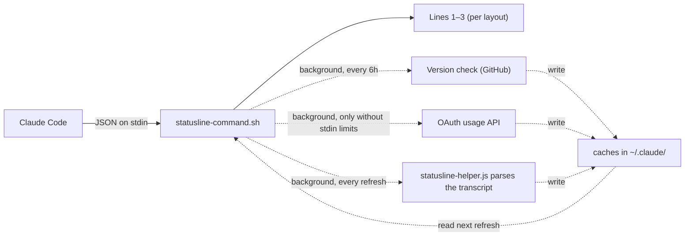

<div align="center">



[](https://github.com/briansmith80/claude-code-status-bar/actions/workflows/shellcheck.yml)
[](https://github.com/briansmith80/claude-code-status-bar/actions/workflows/tests.yml)
[](https://github.com/briansmith80/claude-code-status-bar/releases)
[](LICENSE)

[](https://code.claude.com)

*Your quota burn, context fill, git state, and live activity, visible under every response.*

[](https://briansmith80.github.io/claude-code-status-bar/)

</div>

---

Claude Code warns you about your rate limit and your full context window only once it's already too late to act gracefully. This status bar keeps those numbers, plus your git state, session cost, and what Claude is doing right now, under every response:

<div align="center">


</div>

```
~/my-app on ↱ main  ◆ Opus 4.8 (1M)  ███████░░│ 78% of 1M  5hr (2h20m) ███░░│░░░░ 37%  wk (3d4h) ███████░│░ 72%  +42 -7  ● 3 dirty  ↓2 ↑1  12m  $0.45
→ Edit SignupForm.tsx  [Edit 5 · Read 4 · Bash 2]  │  ⚒ research 12s  │  ██░░░ 2/5 Add tests
```

<sub>**Line 1:** dir · branch · model · context fill · 5h + weekly quota · git state · duration · cost   •   **Line 2:** live tool · tool counts · subagent · todos</sub>

- **Quota**: 5-hour and weekly usage with pacing markers showing where you *should* be for even consumption.
- **Context**: a colour-coded bar that warns *before* auto-compact, not after.
- **Live activity**: a second line of running tools, subagents, and todo progress.
- **Cost**: session cost and burn rate, colour-coded.

Pure bash, no jq, no compiled binaries, one-line install, eight colour themes. Works on macOS, Linux, and Windows (Git Bash); every network call runs in the background, so the bar itself never blocks. Backed by 124 automated tests on all three platforms (plus ShellCheck) in CI.

## Install

**macOS / Linux** (or Git Bash on Windows):

```bash
curl -fsSL https://raw.githubusercontent.com/briansmith80/claude-code-status-bar/main/install.sh | bash
```

**Windows (PowerShell):**

```powershell
irm https://raw.githubusercontent.com/briansmith80/claude-code-status-bar/main/install.ps1 | iex
```

**The status bar appears after the next Claude Code response** (not immediately). It needs only `bash` and `curl`, both already required by Claude Code on every OS; `git` and `Node.js` are optional and just light up extra segments. Re-running either installer is always safe, and it's also how you update.

**Pick a theme** (optional): set `colour_theme` in `~/.claude/statusline.conf` or run `/claude-code-status-bar:configure`, and preview all eight with `bash ~/.claude/statusline-command.sh --demo`.

<details>
<summary>What the installer does (non-interactive, safe to re-run)</summary>

<br>

1. Download `statusline-command.sh`, the two optional Node.js helpers (`statusline-helper.js` for the activity line, `statusline-subagent.js` for the agent panel rows), and the version file into `~/.claude/`.
2. Create `~/.claude/settings.json` with a `statusLine` entry (plus a `subagentStatusLine` entry when Node.js is available), or merge the missing entries into your existing file **without touching your other settings**. The bash installer merges using node, python3, or python; the PowerShell installer does it natively.
3. Existing `statusLine` and `subagentStatusLine` entries are left untouched, with one exception: commands this installer itself wrote in an older format (MSYS-style `/c/...` or unquoted paths, which fail under some spawn shells on Windows) are upgraded in place on re-run. Migrating from another status line? Remove your old entry first, then re-run the installer.
4. If the bash installer finds no JSON-capable interpreter, it prints the exact snippets to paste into `settings.json` yourself.
5. Clear the update-check cache so the new version is picked up immediately.

</details>

<details>
<summary>Windows notes</summary>

<br>

The status bar runs through Git for Windows, which Claude Code on Windows already requires; the PowerShell installer checks for `bash` and tells you what to do if it is missing. Avoid piping `curl.exe` output straight into `bash` from PowerShell: PowerShell 5.1 re-encodes pipeline data between native programs and can corrupt the script. If you prefer the bash installer from PowerShell, run it as one unit instead: `bash -c "curl -fsSL https://raw.githubusercontent.com/briansmith80/claude-code-status-bar/main/install.sh | bash"`

</details>

### Plugin install

If you prefer the Claude Code plugin system:

```
/plugin marketplace add briansmith80/claude-code-status-bar
/plugin install claude-code-status-bar
/claude-code-status-bar:setup
```

The plugin ships two slash commands:

| Command | What it does |
|---------|--------------|
| `/claude-code-status-bar:setup` | Guided install: copies the files from the plugin cache (no network download), configures `settings.json` (asking before replacing an existing `statusLine` entry), runs a smoke test, and offers to set a theme and toggles. |
| `/claude-code-status-bar:configure` | Interactive editor for `~/.claude/statusline.conf`: themes, segment toggles, display options, and grouping, written as a minimal diff against the defaults. |

<details>
<summary><strong>Manual install</strong> (without the installer)</summary>

<br>

1. Download the files to `~/.claude/`:

```bash
curl -fsSL https://raw.githubusercontent.com/briansmith80/claude-code-status-bar/main/statusline-command.sh -o ~/.claude/statusline-command.sh
curl -fsSL https://raw.githubusercontent.com/briansmith80/claude-code-status-bar/main/VERSION -o ~/.claude/.statusline-version
# Optional: live activity line (requires Node.js)
curl -fsSL https://raw.githubusercontent.com/briansmith80/claude-code-status-bar/main/statusline-helper.js -o ~/.claude/statusline-helper.js
```

2. Make it executable: `chmod +x ~/.claude/statusline-command.sh`
3. Add to `~/.claude/settings.json`:

```json
{
  "statusLine": {
    "type": "command",
    "command": "bash ~/.claude/statusline-command.sh"
  }
}
```

</details>

**Jump to:** [Configuration](#configuration) · [Colour themes](#colour-themes) · [Segments](#segments) · [CLI flags](#cli-flags) · [Updating](#updating) · [Troubleshooting](#troubleshooting)

## Highlights

- **Auto-compact awareness**: the context bar marks the exact point where Claude Code will auto-compact and fires a `▲` warning within 20k tokens of it, on any window size.
- **Pacing markers**: a `│` on each usage bar shows where your usage *should* be for even consumption, so "37% used" becomes "37% used and comfortably under pace".
- **Live activity line**: running tools, completed tool counts, subagent status, and todo progress, parsed from Claude Code's transcript by an optional Node.js helper.
- **Subagent panel rows**: a status icon, elapsed time, token cost, and a live `tok/s` burn rate for every running Task-tool subagent.
- **Pure bash, no jq**: bash 3.2+ (stock macOS works); JSON is parsed with bash regex, so there's nothing to compile or install on Windows.
- **Never blocks**: update checks, the usage fallback, and transcript parsing all run in background subshells; the bar renders from caches.

## Layouts (1–3 lines)

By default the bar is two lines — **line 1** the metrics bar (directory, branch, model, context, usage limits, git state, duration, cost) and **line 2** the live activity line. Since v2.19.0 you can rearrange that across **up to three lines**, putting any segment on any line, in any order.

Pick a preset with `layout=`:

| Preset | Line 1 | Line 2 | Line 3 |
|--------|--------|--------|--------|
| `classic` *(default)* | all metrics | live activity | — |
| `three-line` | model · context · usage · duration · cost | dir · branch · git state | live activity |
| `stacked` | dir · branch · model · context · usage · cost | git state · duration | live activity |

Or hand-build each line with a space-separated list of segment **tokens** (these override the preset, per line). **Quote any value with spaces** — `statusline.conf` is sourced as shell:

```bash
# ~/.claude/statusline.conf
line1="model context usage_5h usage_7d duration cost"
line2="dir branch lines_changed ahead_behind dirty stash pr"
line3="activity"
```

Reorder freely (e.g. activity on top), and set a line to `""` to hide that row. Tokens: `dir` `branch` `model` `context` `usage_5h` `usage_7d` `lines_changed` `dirty` `ahead_behind` `stash` `pr` `duration` `worktree` `cost` `cost_rate` `vim` `agent` `effort` `fast_mode` `tokens` `update` `activity`. A token still obeys its `show_*` toggle, unknown tokens are ignored, a segment lives on the first line that lists it, and segments you don't list anywhere won't show. The default (no `layout`/`line*` set) is byte-identical to previous versions.

### Icons

`icon_set=classic` (the default) keeps the original glyphs; `icon_set=modern` switches to a more coherent set — directory ↱, branch ⑂, lines-changed ⇄, and a duration ⏱ that fills a previously-empty slot (model ◆ is unchanged). `use_icons=false` removes all icons regardless of the set.

### The live activity line

Active work pops in theme colours while history recedes into dim text:

```
⠙ Bash npm test 1m24s  │  → Edit SignupForm.tsx  [Edit 5 · Read 4 · Bash 2]  │  ⚒ research 12s  │  ██░░░ 2/5 Add tests
```

| You see | It means |
|---------|----------|
| `⠙ Edit main.ts...` | Tools running right now (up to the last two), in the theme's warning colour behind a spinner; elapsed time appears once a tool runs over 5 seconds and is heat-coloured (green under 30s, yellow under 2m, red beyond, so "stuck" is visible at a glance) |
| `→ Edit main.ts` | The last completed tool, shown when nothing is running; flashes bright green with a `✓` for its first ~5 seconds |
| `✗ Bash npm test` | The most recent tool failure, in red, shown for five minutes |
| `[Edit 5 · Read 4 · Bash 2]` | The top three tool counts for the session |
| `⚒ research 12s` | A running subagent (warning colour) with its heat-coloured elapsed time |
| `⚒ research ✓ (2)` | Finished subagents (and how many) |
| `██░░░ 2/5 Add tests` | Todo progress; filled cells shade through a per-theme gradient |

The spinner advances each time the bar re-renders, so it animates faster with a lower `refreshInterval` (see [Label style](#label-style-reset-time-or-countdown)). When the cached activity ages past `activity_fresh_seconds` (default 45) the colours drop back to all-dim, so stale data reads as stale. Set `activity_colour=false` for the classic all-dim line; `NO_COLOR` and the mono theme degrade to plain text automatically.

<details>
<summary>Activity-line details</summary>

<br>

- The line appears only when there is activity to show. It hides when the cached activity is older than `activity_ttl_seconds` (default 120, chosen to stay above typical `refreshInterval` values) and reappears once the helper has re-parsed the transcript.
- Completed tools, failures, and finished subagents stop being displayed five minutes after they finish; the tool counts cover the whole session.
- Transcript parsing is incremental: each run parses only the lines appended since the last one, so even very long sessions stay cheap. The line is also trimmed to your terminal width (via `$COLUMNS`) so it never wraps.
- Parsing happens in a background process, so the line runs one status bar refresh behind the transcript. That keeps the bar itself instant.
- It requires Node.js on your `PATH`, the `statusline-helper.js` file (installed by default), and a Claude Code version that sends `transcript_path` (2.1+). If any of those are missing, line 2 silently stays off and everything else works.
- Each session gets its own activity cache (keyed by Claude Code's session ID), so parallel Claude Code windows never show each other's activity. Stale per-session caches are swept automatically after a day.
- Disable it entirely with `show_activity=false` in your config.

</details>

## Usage limits & pacing

The bar shows your Anthropic usage limits as colour-coded progress bars with reset labels:

```
5hr (2h20m) ███│░░░░░░ 37%  wk (3d4h) ███████│░░ 72%
```

- **5hr** / **wk**: the rolling 5-hour and 7-day windows, each with the time remaining until reset.
- **`│` pacing marker**: where your usage *should* be for even consumption across the window. Bar past the marker means you are ahead of pace and may hit the limit early; behind it means you have headroom.
- **`~` suffix** (e.g. `37%~`): the data came from the OAuth fallback and is stale (more than two refresh intervals old).

### Label style: reset time or countdown

By default the label counts down the time remaining (`5hr (2h20m)`, `wk (3d4h)`). Set `usage_label=clock` to show the reset moment instead (`5hr (2pm)`, `wk (fri,3am)`).

<details>
<summary>Keeping the countdown fresh with <code>refreshInterval</code></summary>

<br>

The bar re-renders when Claude Code triggers it (after responses and state changes), so a countdown can sit stale while you are away. Claude Code can also re-run the bar on a timer via `refreshInterval` (seconds) on the `statusLine` block. **Fresh installs set `refreshInterval: 60` automatically**; the installer only sets it when it first writes the `statusLine` block, so an existing value is never overwritten. Tune or remove it in `~/.claude/settings.json`:

```json
{
  "statusLine": {
    "type": "command",
    "command": "bash ~/.claude/statusline-command.sh",
    "refreshInterval": 60
  }
}
```

On Windows the script takes ~285ms to run, so keep `refreshInterval` at `2` or higher there; a value below the script's own runtime can blank the bar. Animated effects (`activity_pulse`, `activity_scanner`) need a low **odd** value such as `3` to animate.

</details>

<details>
<summary>Where the usage data comes from (and the OAuth fallback)</summary>

<br>

1. **Stdin (preferred)**: Claude Code 2.1+ sends `rate_limits` directly in the JSON it pipes to the bar. Real-time, zero network requests, no configuration.
2. **OAuth API (fallback)**: older Claude Code versions don't send `rate_limits`, so the script fetches them from `api.anthropic.com/api/oauth/usage` in a background subshell, cached for 10 minutes (`usage_cache_seconds`); on repeated failures it backs off exponentially, up to 30 minutes (tracked in `~/.claude/.statusline-usage-backoff`). It reads your existing Claude Code token, so nothing extra is needed:

| Platform | Credential source |
|----------|------------------|
| macOS | Keychain (`Claude Code-credentials`), falling back to `~/.claude/.credentials.json` |
| Linux | `~/.claude/.credentials.json` |
| Windows / MSYS2 | `~/.claude/.credentials.json` |

The token must have the `user:profile` scope, which browser sign-in grants automatically. Tokens created with `claude setup-token` only have `user:inference` and will not work; quit all Claude Code instances and restart to trigger a fresh browser OAuth login.

If neither source has data, the usage segments are hidden. Run `--dump-stdin` (see [CLI flags](#cli-flags)) to check which fields your Claude Code version sends.

</details>

## Configuration

The installers create `~/.claude/statusline.conf` on first install: a fully commented copy of [`statusline.conf.example`](statusline.conf.example) with every option and its default. Uncomment and edit the lines you want; it's **never overwritten** by updates. Confirm resolved values any time with `--dump-config`. A few common ones:

```bash
# ~/.claude/statusline.conf
colour_theme=default        # default | nord | dracula | solarized | tokyo-night | catppuccin | matrix | mono
bar_gradient=true           # true = theme ramp | false = flat | heat = fixed green→red
usage_label=countdown       # countdown (2h20m) | clock (2pm)
dir_style=auto              # auto (responsive) | full | basename
show_cost_rate=false        # opt-in: $/hr burn rate
auto_update=false           # opt-in: install new versions in the background
```

The full list (every segment toggle, the activity-line options, grouping, and timing) lives in [`statusline.conf.example`](statusline.conf.example).

<details>
<summary>Configuration notes worth knowing</summary>

<br>

- **Gradient bars** (`bar_gradient`, on by default): each filled cell is interpolated along the theme's gradient (the `default` theme uses a green→red heat ramp). `false` gives flat bars; `heat` forces green→red on any theme. No-op under `mono`/`NO_COLOR`. Preview with `--demo`.
- **Context warnings are compaction-aware**: Claude Code auto-compacts at a fixed reserve below the window (~83% of a 200k window, ~97% of a 1M one). With `context_warn_threshold=auto` (default) the `│` marker sits at that point and `▲` fires within 20k tokens of it. Honours `CLAUDE_CODE_AUTO_COMPACT_WINDOW`, the `autoCompactWindow` setting, and `DISABLE_AUTO_COMPACT`; set a number to use a fixed percentage instead.
- **Animated effects** (opt-in `activity_pulse`, `activity_scanner`): need a low **odd** `refreshInterval` such as `3` to animate, otherwise they sit static. `/claude-code-status-bar:configure` can set it for you.
- **Narrow terminals**: with `enable_truncation=true` (default) low-priority segments drop tier by tier (update notice first, directory and branch last), after `dir_style=auto` has already collapsed the path to its basename.
- **Groups**: `use_groups=true` brackets related segments: `[model + context]` `[usage bars]` `[git stats]` `[duration + cost]`.
- **Trust level**: the config is sourced as bash, so treat it like your `.bashrc` and only put your own settings in it. (`show_usage_weekly` still works as an alias for `show_usage_7d`.)

</details>

## Colour themes

Eight built-in themes, spread across a saturation/temperature ladder so no two read alike. Each preview is a **real render** of the bar in that theme (the same output `--demo` prints):

**`default`** · bold, bright primary heat gradient


<details>
<summary><strong>Preview the other seven themes</strong> (dracula · tokyo-night · catppuccin · solarized · nord · matrix · mono)</summary>

<br>

**`dracula`** · neon, electric


**`tokyo-night`** · deep midnight blue + neon


**`catppuccin`** · soft warm pastel


**`solarized`** · earthy, vintage


**`nord`** · muted, cool steel


**`matrix`** · monochrome phosphor green


**`mono`** · greyscale, no colour


</details>

The named themes render in **24-bit truecolour** when your terminal supports it (force with `STATUSLINE_TRUECOLOR=1`/`0`), falling back to the nearest **256-colour**. `default` tracks your terminal's own ANSI palette; `matrix` is a monochrome phosphor-green tribute (removals are dim green, not red); `mono` and [`NO_COLOR`](https://no-color.org/) drop all colour. Set `colour_theme` in `statusline.conf` (or run `/claude-code-status-bar:configure`); it takes effect on the next render, and `--dump-config | grep colour_theme` confirms it applied.

## Updating

When a new version is available you'll see `↑ <version>` in the bar (e.g. `↑ 2.18.1`), clickable through to that release's notes. The check runs in the background every 6 hours. The simplest way to update is the built-in self-update:

```bash
bash ~/.claude/statusline-command.sh --update
```

It downloads the latest script and helpers, swaps them in only once every file has downloaded, bumps the version, and leaves your `settings.json` entries alone. It also refreshes `statusline.conf.example` and, **only if you don't have a `statusline.conf` yet**, creates one from it; your existing config is never overwritten. Run `--check-update` first to see what's current versus latest. (Too old to have `--update`? Re-running the [installer](#install) also updates in place.)

### Automatic updates (opt-in)

Set `auto_update=true` in `statusline.conf` and the bar installs new versions for you: once the background check flags a newer release, it runs the same self-update in a detached background process (it never blocks rendering), serialised with a lock so parallel sessions don't all download at once. A failed or interrupted download changes nothing, and `statusline.conf`/`settings.json` are never touched. It stays off by default so the tool never replaces its own executable without you asking.

## Uninstall

```bash
bash ~/.claude/statusline-command.sh --uninstall
```

It lists what will be deleted and asks for confirmation, prompts **separately** before removing `statusline.conf` (so you can keep your config for a reinstall), and reminds you to remove the `statusLine` block from `~/.claude/settings.json` yourself.

<details>
<summary>Manual removal, if you prefer</summary>

<br>

```bash
rm -f ~/.claude/statusline-command.sh
rm -f ~/.claude/statusline-helper.js
rm -f ~/.claude/statusline-subagent.js
rm -f ~/.claude/.statusline-version
rm -f ~/.claude/.statusline-update-cache
rm -f ~/.claude/.statusline-usage-cache
rm -f ~/.claude/.statusline-usage-backoff
rm -f ~/.claude/.statusline-activity-cache
rm -f ~/.claude/.statusline-activity-cache.*
rm -rf ~/.claude/.statusline-transcript-cache
rm -f ~/.claude/statusline.conf   # your config; skip this line to keep it
```

Then remove the `"statusLine"` block from `~/.claude/settings.json`.

</details>

## Segments

All segments are on by default except token counts and cost rate. Zero-valued segments auto-hide (configurable via `auto_hide`), and segments whose data is missing are simply omitted, so your actual bar is usually shorter than the full list.

<details>
<summary>All 21 line-one segments</summary>

<br>

| Segment | Looks like | Toggle | Notes |
|---------|-----------|--------|-------|
| Directory | `~/my-app` | `show_directory` | Prefers `workspace.current_dir`, falls back to `cwd`; home shown as `~` |
| Branch | `on ↱ main` | `show_branch` | Short commit hash when detached; truncate long names with `branch_max_length` |
| Vim mode | `NORMAL` | `show_vim_mode` | Only when Claude Code sends `vim.mode` |
| Model | `◆ Opus 4.8 (1M)` | `show_model` | Tier colours: Haiku green, Sonnet yellow, Opus orange, Fable purple (theme-aware); the redundant " context" is trimmed from the name |
| Agent name | `▸ my-agent` | `show_agent` | Only when running with an agent |
| Effort level | `eff:xhigh` | `show_effort` | Reasoning effort, when Claude Code sends `effort.level` (CC 2.1.133+) |
| Fast mode | `⚡ fast` | `show_fast_mode` | Only when fast mode is on; yellow because it bills at a higher rate |
| Context bar | `███████░│░ 78% of 200k` | `show_context_bar` | Green under 50%, yellow 50-79%, red 80%+. The `│` marker sits at the auto-compact point; `▲` appears within 20k tokens of it |
| Token counts | `45k in 12k out` | `show_tokens` *(off)* | Tokens in the current context (cumulative session totals before CC 2.1.132) |
| 5-hour usage | `5hr (2h20m) ███│░░░░░░ 37%` | `show_usage_5h` | Rolling 5-hour window with countdown to reset and pacing marker |
| Weekly usage | `wk (3d4h) ███████│░░ 72%` | `show_usage_7d` | Rolling 7-day window with countdown to reset and pacing marker |
| Lines changed | `+42 -7` | `show_lines_changed` | Session lines added (green) and removed (red) |
| Dirty count | `● 3 dirty` | `show_dirty_count` | Staged + unstaged + untracked files |
| Ahead/behind | `↓2 ↑1` | `show_ahead_behind` | Commits behind/ahead of upstream; hidden when there is no upstream |
| Stash count | `≡ stash:2` | `show_stash` | Git stash entries |
| Pull request | `PR #1234` | `show_pr` | Open PR for the branch (CC 2.1.145+); colour = review state: green approved, yellow pending, red changes requested, dim draft. Clickable in terminals with OSC 8 support; `pr_link=false` disables |
| Duration | `12m` / `1h23m` | `show_duration` | Session duration |
| Worktree | `⊞ hotfix` | `show_worktree` | Worktree name; covers `--worktree` sessions and any linked git worktree (CC 2.1.145+) |
| Cost | `$0.45` | `show_cost` | Green under $1, yellow $1-5, red $5+ |
| Cost rate | `$2.10/hr` | `show_cost_rate` *(off)* | Burn rate; appears once the session is over a minute old |
| Update notice | `↑ 2.18.1` | *(automatic)* | Background version check against GitHub every 6 hours; shows the new version, links to its release notes, and `--update` installs it |
| Live activity | *(its own line by default; place anywhere via `layout`)* | `show_activity` | Running tools, tool counts, subagents, todo progress; `activity_colour=false` for the classic all-dim look |

Every segment above is also a layout **token** you can assign to a specific line. Most token names match the toggle's `show_*` suffix (e.g. `usage_5h`, `lines_changed`), but a few are shorter — `vim` (`show_vim_mode`), `context` (`show_context_bar`), `dirty` (`show_dirty_count`). The token list under [Layouts](#layouts-13-lines) is the source of truth.

</details>

Before the first API response of a session, the bar shows a dim `Starting...` placeholder. That is normal; the real segments appear as soon as Claude Code sends model and context data.

## CLI flags

The script normally runs with no arguments, fed JSON on stdin by Claude Code. The flags are for setup, diagnostics, and removal; the handy ones are `--update`, `--demo`, `--check-update`, and `--uninstall`.

<details>
<summary>All CLI flags</summary>

<br>

| Flag | Description |
|------|-------------|
| `--help`, `-h` | Show usage info and exit. |
| `--version`, `-v` | Print the installed version and exit. |
| `--check-update` | Clear the update cache and synchronously check GitHub for a newer version. Prints current and latest, plus the `--update` command if an update exists. |
| `--update` | Download and install the latest version in place: overwrites `statusline-command.sh` and the two Node helpers, bumps `.statusline-version`, and clears the update cache. Each file is staged and only swapped in once every download succeeds, so a failed fetch changes nothing. Never touches `statusline.conf` or `settings.json`. |
| `--dump-config` | Print the resolved configuration (defaults merged with your `statusline.conf`) as sorted `key=value` lines. The fastest answer to "why isn't my override taking effect?" |
| `--dump-stdin` | Echo the JSON Claude Code sends (pretty-printed when a working python3 is on PATH) plus a YES/NO report of detected fields: `rate_limits`, `transcript_path`, nested `model`, nested `context_window`. Pipe JSON in: `echo '<json>' \| bash ~/.claude/statusline-command.sh --dump-stdin` |
| `--benchmark [N]` | Time N end-to-end runs (default 5) against a realistic canned payload and report min/avg/max, for picking a safe `refreshInterval`. Needs GNU date `%N` (Linux/MSYS2). Add `STATUSLINE_PROFILE=1` to any run for a per-phase breakdown on stderr. |
| `--demo [theme]` | Preview a theme with a realistic canned payload, e.g. `--demo tokyo-night`. With no argument (or `all`) it cycles all eight themes, each labelled. Renders without touching your `statusline.conf`. |
| `--uninstall` | Interactively remove all installed files. See [Uninstall](#uninstall). |

</details>

## Subagent status line

While Task-tool subagents run, Claude Code shows an agent panel below the prompt. The optional `statusline-subagent.js` renderer (wired automatically when Node.js is available) restyles those rows to match the status bar and adds live numbers:

```
⚒ Audit the usage parsing code  1m24s · 12.4k tok · 354 tok/s ▄▅▆▇▇▆█
✓ Verify the rate-limit fix     3m2s · 48.1k tok
✗ security review               41s · 2k tok
```

<details>
<summary>How the subagent rows work</summary>

<br>

- **Status at a glance**: `⚒` running (yellow), `✓` done (green), `✗` failed (red), `◌` queued (dim), using your `colour_theme` and honouring `NO_COLOR`.
- **Elapsed time** per task, ticking with each panel refresh (roughly every 5 seconds).
- **Token cost and burn rate**: Claude Code samples each task's token count on every refresh; the renderer turns those samples into a `tok/s` rate plus a small sparkline, so a runaway agent is visible before it finishes.
- **Aligned and width-aware**: descriptions are padded into a column across rows, and each row is trimmed to the panel width (the sparkline is dropped first, then the rate).
- **Fail-safe**: on any error or unexpected input the script prints nothing and Claude Code falls back to its default rows. Set `subagent_rows=false` in `statusline.conf` to keep the defaults permanently.
- **Scope**: Claude Code only delegates Task-tool subagent rows to custom renderers (verified against CC 2.1.170). Workflow and background-task rows are drawn by a separate panel path and keep Claude Code's built-in style.

The installer wires this into `settings.json` when Node.js is present, leaving any existing entry untouched. On Windows it writes a quoted Windows-native path instead of `~` (e.g. `node "C:/Users/name/.claude/statusline-subagent.js"`), because Claude Code may spawn the command via PowerShell or cmd, which don't expand `~` or resolve MSYS `/c/...` paths for node.

```json
{
  "subagentStatusLine": {
    "type": "command",
    "command": "node ~/.claude/statusline-subagent.js"
  }
}
```

</details>

## Troubleshooting

- **The bar doesn't appear at all.** Check that `~/.claude/settings.json` has the `statusLine` entry (the installer skips this step if any `statusLine` entry already exists, including one from a different status line). Then wait for the next Claude Code response; the bar renders after responses, not on launch.
- **The bar disappeared after setting a low `refreshInterval`.** Claude Code aborts an in-flight statusLine run when the next one starts, and an aborted run blanks the bar. If the interval is below the script's runtime, every run is aborted and nothing ever renders. Measure with `--benchmark` (~285ms on Windows under MSYS bash, well under 100ms on macOS/Linux), then pick an interval comfortably above it: `2`+ on Windows, `1` elsewhere.
- **The bar just says `Starting...`** Normal. It means Claude Code hasn't sent model or context data yet, which happens at the start of every session.
- **A segment I enabled isn't showing.** Most segments auto-hide when their value is zero or their data is missing. Run `--dump-config` to confirm your override took effect, and `--dump-stdin` to see which fields your Claude Code version actually sends.
- **Usage segments are missing.** On Claude Code 2.1+ they should appear automatically from stdin. For the OAuth fallback, check credentials exist (see [Where the usage data comes from](#usage-limits--pacing)), then clear the caches: `rm -f ~/.claude/.statusline-usage-cache ~/.claude/.statusline-usage-backoff`. After repeated failures the script waits up to 30 minutes before retrying.
- **Usage shows `~` after the percentage.** The OAuth data is stale. Usually transient; if it persists, clear the two cache files above.
- **The activity line never appears.** It needs Node.js on `PATH`, `~/.claude/statusline-helper.js`, and a Claude Code version that sends `transcript_path` (`--dump-stdin` reports this as YES/NO). It also lags one refresh behind and hides when its cache is older than `activity_ttl_seconds` (default 120).
- **`--check-update` shows an old version right after a release.** GitHub's raw CDN caches for a few minutes. Try again shortly.

## Security

Points that matter for a tool that runs on every response and can read your OAuth token:

- All cache and temp files are created with `umask 077` (owner-readable only).
- The OAuth token is passed to curl via `--config -` on stdin, so it never appears in the process list. The wget fallback can't do this (curl is strongly preferred) and runs with `--max-redirect=0` to prevent token leakage on redirects.
- Branch names, paths, worktree names, and all transcript-derived text are stripped of ANSI escapes and control characters before being printed.
- `~/.claude/statusline.conf` is sourced as bash; it has the same trust level as your `.bashrc`. The helper stores activity summaries, not transcript content (tool names, file basenames, and short snippets, 30-50 chars at most).

## More

<details>
<summary>How it works</summary>

<br>

Claude Code pipes a JSON payload to the script on every refresh. The script parses it with bash regex (no jq), builds the segments, and prints one to three lines per your [layout](#layouts-13-lines). Everything slow happens in background subshells that write caches; the bar only ever reads caches, so it never waits on the network or on transcript parsing.



Files at `~/.claude/` after install:

| File | Purpose | Overwritten on update? |
|------|---------|----------------------|
| `statusline-command.sh` | The script Claude Code runs | Yes |
| `statusline-helper.js` | Node.js transcript parser (optional) | Yes |
| `statusline-subagent.js` | Node.js subagent panel renderer (optional) | Yes |
| `.statusline-version` | Installed version | Yes |
| `statusline.conf` | Your config overrides | **Never** |
| `.statusline-update-cache` | Update check cache | Cleared on update |
| `.statusline-usage-cache` | OAuth usage cache | Auto-refreshes |
| `.statusline-usage-backoff` | OAuth failure backoff state | Auto-expires |
| `.statusline-activity-cache.<id>` | Live activity cache (one per session) | Auto-refreshes, swept after a day |
| `.statusline-transcript-cache/` | Parsed transcript cache | Auto-invalidates |

All caches are created with `umask 077`, so they are readable only by you.

</details>

<details>
<summary>Repository layout</summary>

<br>

```
claude-code-status-bar/
├── README.md
├── CHANGELOG.md                  # release history
├── LICENSE                       # MIT
├── VERSION                       # single source of truth for the version
├── install.sh                    # one-line installer / updater (macOS, Linux, Git Bash)
├── install.ps1                   # one-line installer / updater (Windows PowerShell)
├── statusline-command.sh         # the status bar (pure bash, installed to ~/.claude/)
├── statusline-helper.js          # optional Node.js transcript parser (live activity line)
├── statusline-subagent.js        # optional Node.js renderer for the subagent panel rows
├── docs/
│   └── assets/                   # README images + generators (hero, animated demo, per-theme previews under themes/)
├── commands/
│   ├── setup.md                  # /claude-code-status-bar:setup
│   └── configure.md              # /claude-code-status-bar:configure
├── .claude-plugin/
│   ├── plugin.json               # plugin manifest
│   └── marketplace.json          # marketplace catalog for /plugin marketplace add
├── .github/workflows/
│   ├── shellcheck.yml            # lint (pushes to main, PRs)
│   └── tests.yml                 # BATS suite on Linux, macOS, Windows (MSYS2)
├── tests/                        # 124 BATS tests across 13 files
├── ROADMAP.md                    # feature roadmap & competitive landscape
├── SPRINTS.md                    # sprint plan
└── CLAUDE.md                     # project guide for working on this repo with Claude Code
```

</details>

<details>
<summary>Running the tests</summary>

<br>

A BATS suite under [`tests/`](tests/) covers schema parsing, segments, all eight themes (truecolour, 256-colour fallback, and `NO_COLOR`), config overrides, context window formatting and compaction awareness, the live activity helper, the colourful activity line, the git segments, the styling options, the PR link, the self-update and `auto_update` paths, and the subagent panel renderer. Each test runs in a sandboxed `HOME`, so your real config and credentials are never touched. CI runs the suite on Linux, macOS, and Windows (MSYS2), plus ShellCheck.

```bash
brew install bats-core            # macOS
sudo apt-get install -y bats      # Debian / Ubuntu
# Windows (Git Bash / MSYS2): no pacman package; clone bats-core
git clone --depth 1 https://github.com/bats-core/bats-core.git ~/bats-core

bats tests/                       # macOS / Linux
~/bats-core/bin/bats tests/       # Windows
```

See [`tests/README.md`](tests/README.md) for layout details.

</details>

## Changelog

Full release history lives in [CHANGELOG.md](CHANGELOG.md). Recent highlights:

- **2.18.1**: `--update` and `auto_update` now also seed the commented `statusline.conf` (only when absent), so self-update-only users get the starter config too.
- **2.18.0**: Better defaults out of the box: gradient bars on by default, a responsive `dir_style=auto` that collapses a long path before any segment is dropped, a commented `statusline.conf` the installers create, and a tidier `Opus 4.8 (1M)` model name.
- **2.14.0**: The named themes redesigned in 24-bit truecolour (with a 256-colour fallback) and spread across a saturation/temperature ladder so no two read alike.
- **2.11.0 / 2.12.0**: One-command self-update (`--update`, atomic staged downloads) and opt-in `auto_update`, plus an update notice that links straight to the release notes.

## License

MIT, see [LICENSE](LICENSE).
