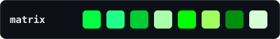

# Theme palette preview — current vs proposed

Proposed = each theme's **official** palette, deliberately spread across a saturation/temperature ladder so no two read alike: **NEON** (dracula) · **BOLD** (default) · **DEEP** (tokyo-night) · **SOFT PASTEL** (catppuccin) · **EARTHY** (solarized) · **MUTED** (nord) · **MONOCHROME** (matrix) · **GREYSCALE** (mono). Shown here in truecolour (the best case; terminals without truecolour fall back to the nearest 256-colour). Swatch order: directory · branch · model · Opus accent · additions · warnings/cost · removals · pacing.

| Theme | Current | Proposed | Character |
|---|---|---|---|
| `default` |  |  | BOLD — bright primary ANSI (your terminal’s own palette) |
| `nord` |  |  | MUTED — cool steel/slate, the most subdued theme |
| `dracula` |  |  | NEON — electric, maximum saturation |
| `solarized` |  |  | EARTHY — vintage, desaturated, teal + amber |
| `tokyo-night` |  |  | DEEP — midnight royal-blue + violet base, hot neon accents |
| `catppuccin` |  |  | SOFT PASTEL — warm lavender, peach, pink |
| `matrix` |  |  | MONOCHROME — phosphor digital-rain green |
| `mono` |  |  | GREYSCALE — no colour |
