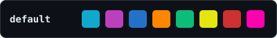
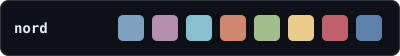
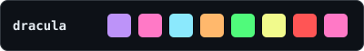
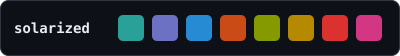
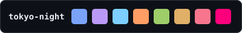
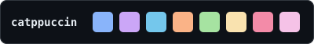

# Theme palette preview — current vs proposed

Proposed = each theme's **official** palette, leaned into a distinct character, shown here in truecolour (the best case; terminals without truecolour would fall back to the nearest 256-colour). Swatch order: directory · branch · model · Opus accent · additions · warnings/cost · removals · pacing.

| Theme | Current | Proposed | Character |
|---|---|---|---|
| `default` |  |  | classic bright ANSI (your terminal’s own palette) — unchanged |
| `nord` |  |  | muted / icy — low saturation, frost blues |
| `dracula` |  |  | neon / vivid — high saturation |
| `solarized` |  |  | earthy / vintage — desaturated, balanced |
| `tokyo-night` |  |  | deep blue night with a warm orange accent |
| `catppuccin` |  |  | cozy warm pastel — lavender, peach |
| `mono` |  |  | no colour, neutral grey ramp — unchanged |
